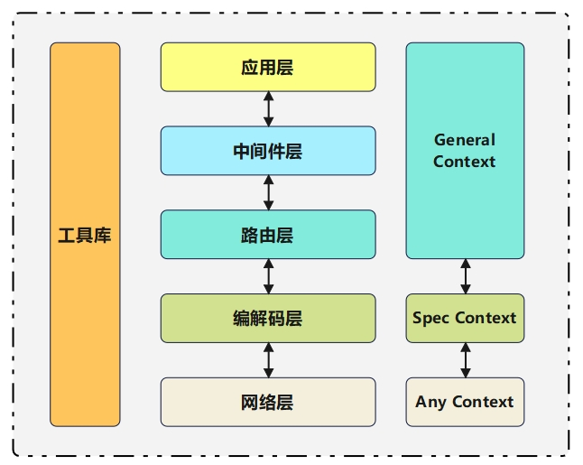

# vvnet：高性能易用网络服务器框架

个人学习项目，Linux平台下的C++网络服务器框架。基于解耦架构思想,设计并实现了一个具有多层级结构的网络服务器框架旨在提供可灵活拓展,功能丰富的高性能易用网络服务器

### **主要特点**

#### **1.基于动态设计的高性能网络库**

- 采用非阻塞I/O与/O多路复用的Reactor模型,结合多线程设计,实现支持高并发的底层tcp网络库

- 实现动态自增长缓冲区,动态调整大小以适配不同任务请求,优化内存分配

- 实现支持动态扩容的线程池,配合一致性哈希轮询算法,为连接分配合适的处理线程,实现一定程度上的负载均衡。使用时间轮实现定时器,高效管理连接任务

#### **2.解耦架构的高拓展性**

- 基于不同的编解码协议,以编解码层为界,向下在网络层设计实现了通用类型,保存传入的任意结构上下文。向上借助运行时多态特性,使用基类对象统一编排服务流程,传递上下文信息、各种编解码协议的上下文均可快速链接到网络框架中

#### **3.丰富的功能组件**

- 在编解码层,目前框架已实现htp、websocket等协议。在路由层,使用前缀树实现路由解析
支持静态路由、参数路由与通配路由的使用。在中间件层,借助洋葱模型设计,实现了自定义中间件与业务逻辑的耦合关联

<p align="center">
  
</p>

### **编译**

```bash
# 创建build空间
mkdir build && cd build
# cmake构建
cmake ..
# make编译
make
# 运行
./vvnet
```

### **使用示例 (test.cc)**

```cpp
#include <iostream>

#include "http/HttpCore.h"
#include "vvlog/vvlog.h"

// 中间件
void middle1(Context* ctx){
    std::cout<<"middle1 before"<<std::endl;
    ctx->next();
    std::cout<<"middle1 after"<<std::endl;
}

void middle2(Context* ctx){
    std::cout<<"middle2 before"<<std::endl;
    ctx->next();
    std::cout<<"middle2 after"<<std::endl;
}

int main(){
    HttpServer* server=new HttpServer(12345);   // 初始化服务器

    LOG_INIT("log", "vvnet", INFO); //日志init

    server->Get("/",[](Context* ctx){
        LOG_INFO("hello HUST");
        std::cout<<"hello HUST"<<std::endl;
        return "hello HUST!";
    });

    server->use(middle1);
    server->use(middle2);    // 使用中间件

    server->setThreadNum(4);    // 设置多线程

    server->useTimer(10);   // 启动定时器

    Signal::signal(SIGINT, [&] {
        std::cout << "\nServer exit!" << std::endl;
        delete server;
        exit(0);
    });

    server->spin();

    return 0;
}
```